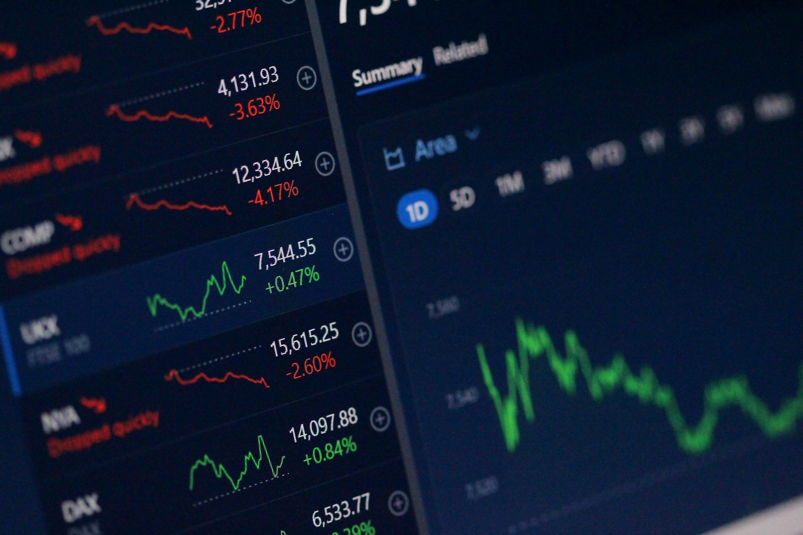
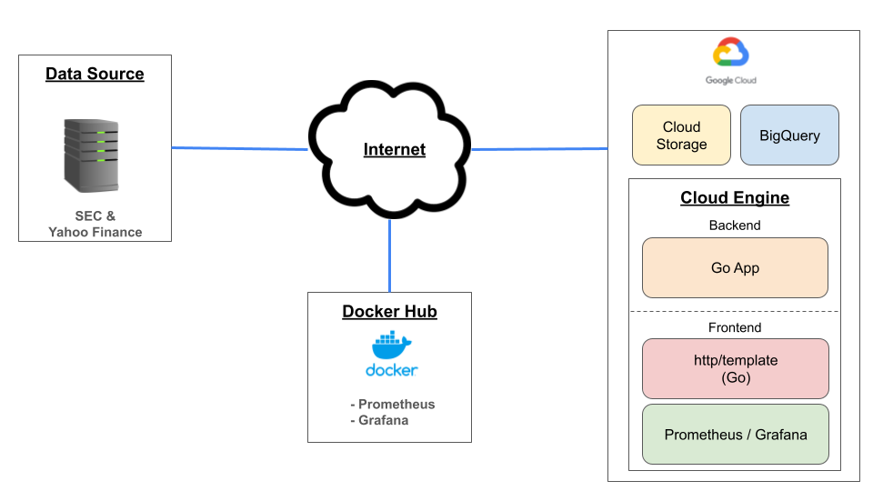
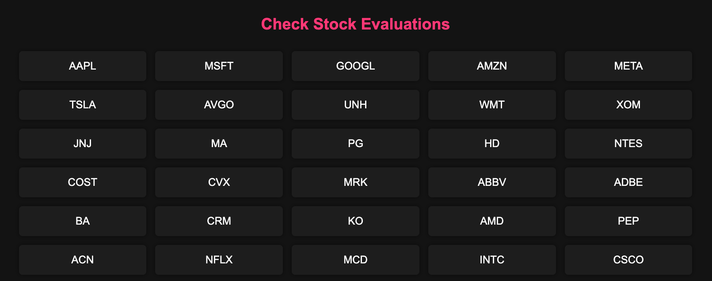
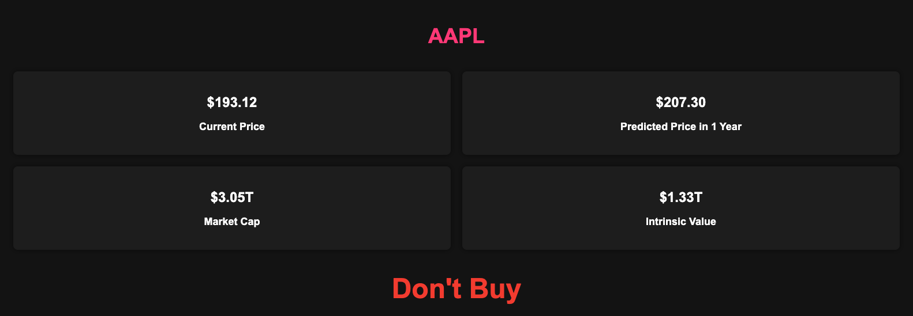

# Stock-Analysis



Photo by <a href="https://unsplash.com/@polarmermaid?utm_content=creditCopyText&utm_medium=referral&utm_source=unsplash">Anne Nygård</a>


## Requirements
- Google Cloud Platform account with access to:
    - BigQuery
    - Cloud Engine
    - Cloud Storage

## Technologies Used
- Docker, Golang, GCP (BigQuery, Cloud Engine, Cloud Storage), Prometheus, Grafana

## Table of Contents

1. [Introduction](#introduction)
2. [Implementation](#implementation)
3. [Setup](#setup)
    - [GCP Configuration](#gcp-configuration)
    - [Local Configuration](#local-configuration)
4. [How to Run](#how-to-run)
5. [Frontend](#frontend)
6. [Conclusion and future works](#conclusion-and-future-works)
- [Built with](#built-with)
- [Author](#author)
## Introduction
This project focuses on predicting the future stock price over a one-year period, utilizing fundamental analysis to provide long-term investment insights. By leveraging free resources such as the SEC API and Yahoo Finance, this project eliminates the need for any sign-ups for data collection, ensuring a seamless experience. The project is built on Google Cloud Platform (GCP), utilizing BigQuery, Cloud Engine, and Cloud Storage. The prediction model is built with BigQuery's AutoML. There is an MVP frontend where users can select a stock ticker to view buy recommendations based on the model's predictions. Additionally, the frontend comes with monitoring with Prometheus and Grafana.

**DISCLAIMER:** The information contained on this project is not intended as, and shall not be understood or construed as, financial advice.

## Implementation
The Design diagram for this project is shown below. There are 4 main elements to it.

1. **Backend:** The Go app is the main component that stores and process data to Cloud Storage and BigQuery.
2. **Frontend:** Go's http/template is the main UI framework for this application. The frontend will display prediction results of future stock price using BigQuery's AutoML model. Prometheus and Grafana are used to monitor the performance of the application.
3. **BigQuery & Cloud Storage:** The backend Go app will store the data in CSV locally then push it to Cloud Storage which will then ultimately store the it in BigQuery. BigQuery is the main database where the preprocessing, model training/prediction, and data retrieval take place.
4. **Data Source:** The data source is the [SEC's API](https://www.sec.gov/edgar/sec-api-documentation) and [Yahoo Finance](https://finance.yahoo.com/). Many of the code base for Yahoo Finance's data retrieval was inspried by [Mark Chenoweth's go-quote library](https://pkg.go.dev/github.com/markcheno/go-quote).



## Setup
### GCP Configuration
You must create a GCP project, enable billing, and allow API access for BigQuery and Cloud Storage. Below are some resources and tutorials.

- [Create projects in GCP](https://cloud.google.com/resource-manager/docs/creating-managing-projects)
- [How to allow API access](https://youtu.be/cTI7BFVoIwA?si=f0GXlwwx0gormFvP)

For the Cloud Storage VM instance, you must conduct the following:
- Allow http/https access for the instance.
- Open ports `8080`, `3000`, `9090` for the instance.
    -  [How to Open Port Tutorial](https://youtu.be/-RjDWwTZUnc?si=5pYQO7MD_zvjmOJo)
- Allow API BigQuery Admin and Storage Admin for the VM instance.

The VM instance machine type can be minimal (e2-micro, etc.) to run.

### Local Configuration
The basic configuration file for this repository is [`.env`](.env). Set the following configurations accordingly.

**Required**
```.env
GOOGLE_CLOUD_PROJECT=<YOUR GOOGLE CLOUD PROJECT ID>
BUCKET_NAME=<YOUR GOOGLE CLOUD STORAGE BUCKET NAME>
```
*Optional*
```.env
# GCP Database Settings
DATASET_NAME=<YOUR DATASET NAME>
FINANICIAL_TABLE_NAME=<TABLE NAME FOR FINANCIAL DATA>
STOCK_TABLE_NAME=<TABLE NAME FOR STOCK PRICE>
ML_TABLE_NAME=<TABLE NAME FOR PREPROCESSED DATA>

# Financial Data (10K)
START_YEAR=<START YEAR FOR FINANCIAL DATA> # Choose 2007 or After
END_YEAR=<END YEAR FOR FINANCIAL DATA>
HEADER=<HEADER EMAIL FOR SEC DATA RETRIEVAL>
TOPTICKERS=<NUMBER OF TICKERS TO GATHER DATA FROM IN ORDER OF backend/data/company_tickers.json>

# Stock Price Data
START_DATE=<START DATE FOR STOCK PRICE DATA>
END_DATE=<END DATE FOR STOCK PRICE DATA>
```

## How to run
Start the VM instance in Cloud Engine and login in to VM instance in Cloud Shell.

```
# Login to VM instance from Cloud Shell
gcloud compute ssh --<YOUR GOOGLE CLOUD PROJECT ID> --zone=<YOUR INSTANCE ZONE> <YOUR INSTNACE NAME>
```

After logging into VM instance run the following commands to complete set up.
```
# After logging into VM instance
sudo apt update
sudo apt install git --yes
git clone https://github.com/taksug229/Stock-Analysis.git
cd Stock-Analysis/
sudo apt install docker-compose --yes
vim .env # Edit the .env file based on the previous file
```
Build the Docker image. **This command will take 2-3hrs to complete due to AutoML model creation in BigQuery**
```
# This will take around 2-3 hrs to complete due to AutoML model creation in BigQuery
sudo docker-compose -f docker-compose.setup.yml up
```
Start the app.

```
sudo docker-compose up
```

## Frontend
Once the [commands](#how-to-run) are run successfully, you can acccess the following pages

- **<external_ip>:8080/**
    - Main page. Shows the available tickers to view buy recommendation. Click on a ticker to view the details.



- **<external_ip>:8080/ticker/<ticker>**
    - Once you click a ticker from the main page, it will show the purchase recommendation based on future stock price prediction and the intrinsic value.

TODO Complete imgs



- **<external_ip>:9090/**
    - [Prometheus](https://prometheus.io/docs/introduction/overview/) page for monitoring.


- **<external_ip>:3000/**
    - [Grafana](https://grafana.com/docs/grafana/latest/) page for visualization of Prometheus.

TODO: Show sample image

## Conclusion and future works
This application offers valuable advantages through its use of free APIs and flexible design. Users can adjust parameters like the number of companies and the time frame for data retrieval using a configuration file (.env). This ensures the application can cater to various user needs. There's also monitoring features embedded utilizing Prometheus and Grafana.

For future works I want to improve data consistency and frontend design.

In the SEC website, companies use different naming conventions for financial metrics, complicating data retrieval. This makes gathering comprehensive financial information for all companies difficult. Currently, the application can retrieve roughly 55% of S&P 500 companies so there is room for improvement.
The current frontend interface is at the Minimum Viable Product (MVP) stage. While functional, it lacks user-friendly design.

## Built With
[Docker](https://www.docker.com/), [Go](https://go.dev/), [BigQuery](https://cloud.google.com/bigquery), [Prometheus](https://prometheus.io/docs/introduction/overview/), [Grafana](https://grafana.com/docs/grafana/latest/)

## Author
* **Takeshi Sugiyama** - *Data Scientist*
  * [Linkedin](https://www.linkedin.com/in/takeshi-sugiyama/)
